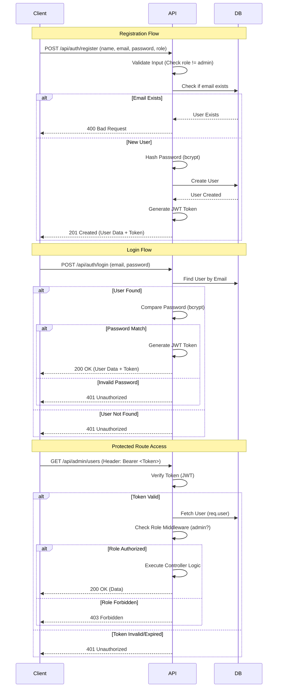

# Authentication & Authorization System

## 1. Authentication Flow Diagram



## 2. API Endpoints

### Authentication
| Method | Endpoint | Access | Description |
| :--- | :--- | :--- | :--- |
| `POST` | `/api/auth/register` | Public | Register a new customer or tailor. (Admin role blocked) |
| `POST` | `/api/auth/login` | Public | Authenticate user and receive JWT. |

### User Management (Protected)
| Method | Endpoint | Access | Description |
| :--- | :--- | :--- | :--- |
| `GET` | `/api/users/profile` | Private | Get authenticated user's profile. |
| `PUT` | `/api/users/profile` | Private | Update authenticated user's profile. |
| `GET` | `/api/admin/users` | Admin | Get list of all users. |

## 3. Role-Based Middleware Logic

The system uses two primary middleware functions located in `server/middleware/authMiddleware.js`.

### `protect` Middleware
1.  **Extraction**: Looks for `Authorization` header with `Bearer <token>`.
2.  **Verification**: Uses `jwt.verify` with valid secret.
3.  **User Attachment**: Fetches user from DB (excluding password) and attaches to `req.user`.
4.  **Error Handling**: Returns `401 Not authorized` if token is missing or invalid.

### `authorize(...roles)` Middleware
1.  **Prerequisite**: Must run *after* `protect`.
2.  **Check**: Verifies if `req.user.role` is included in the allowed `roles` arguments.
3.  **Outcome**:
    -   If match: calls `next()`.
    -   If mismatch: Returns `403 Forbidden` with specific message.

**Usage Example:**
```javascript
router.get('/users', protect, authorize('admin'), getUsers);
```

## 4. Error Handling Scenarios

| Scenario | HTTP Status | Error Message | Action |
| :--- | :--- | :--- | :--- |
| **Invalid Email/Password** | `401 Unauthorized` | "Invalid email or password" | Client prompts user to retry. |
| **User Already Exists** | `400 Bad Request` | "User already exists" | Client suggests logging in. |
| **Token Missing** | `401 Unauthorized` | "Not authorized, no token" | Client redirects to login. |
| **Token Expired/Invalid** | `401 Unauthorized` | "Not authorized, token failed" | Client clears storage, redirects login. |
| **Forbidden Role** | `403 Forbidden` | "User role [role] is not authorized..." | Client shows "Access Denied" page. |

## 5. Security Measures Implemented
1.  **Password Hashing**: Bcrypt used for salt+hash before storage.
2.  **JWT**: Stateless session management.
3.  **Role Validation**: Registration endpoint explicitly blocks creation of `admin` role via public API.
